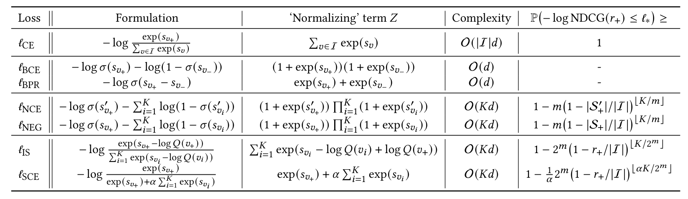
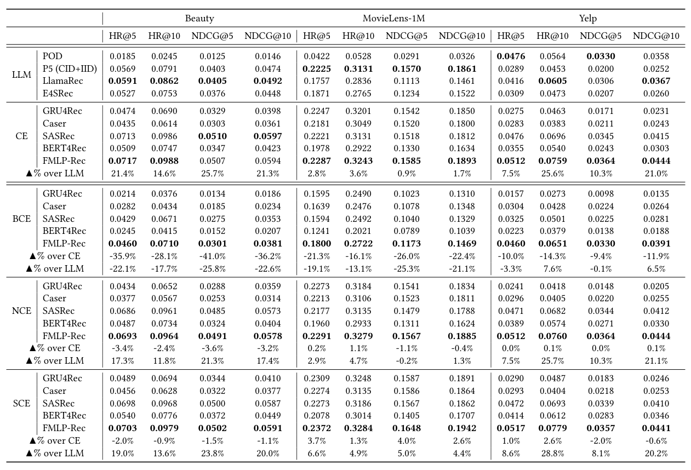

## Requirements:

Python==3.9 | [PyTorch==1.12.1](https://pytorch.org/) | [TorchData==0.4.1](https://github.com/pytorch/data) | [FreeRec==0.6.3](https://github.com/MTandHJ/freerec)

Use the following commands to prepare the environment (**CUDA: 11.3**):
```
conda create --name=PyT12 python=3.9; conda activate PyT12; bash setup_env.sh
```

## Usage

This repo separately provides the implementaion of each conventional method mentioned in the paper. 
They can be conducted as follows

- **CE**:
```
python main.py --config=configs/MovieLens1M_550_Chron.yaml --loss=CE
```

- BCE:
```
python main.py --config=configs/MovieLens1M_550_Chron.yaml --loss=BCE --num-negs=1 --neg-pool=unseen
```

- BPR:
```
python main.py --config=configs/MovieLens1M_550_Chron.yaml --loss=BPR --num-negs=1 --neg-pool=unseen
```

- **NCE (c=10)**:
```
python main.py --config=configs/MovieLens1M_550_Chron.yaml --loss=NCE --c=10 --num-negs=100 --neg-pool=all
```

- NEG:
```
python main.py --config=configs/MovieLens1M_550_Chron.yaml --loss=NEG --num-negs=100 --neg-pool=all
```

- **SCE**:
```
python main.py --config=configs/MovieLens1M_550_Chron.yaml --loss=SCE --alpha=100 --num-negs=100 --neg-pool=all
```

**Note:** Refer to `benchmarks` for logs of 5 independent runs.


## Results

